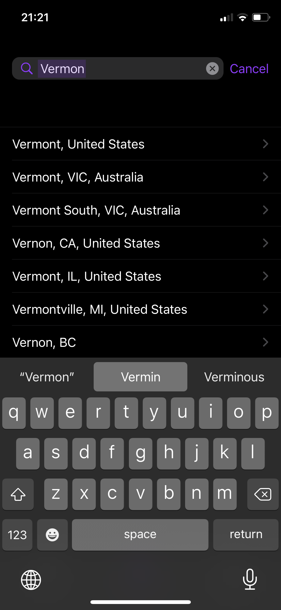
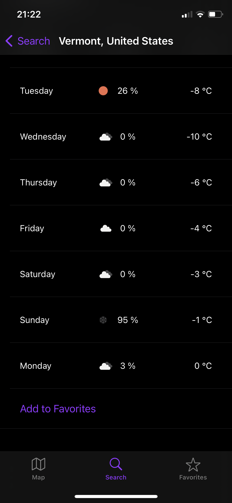
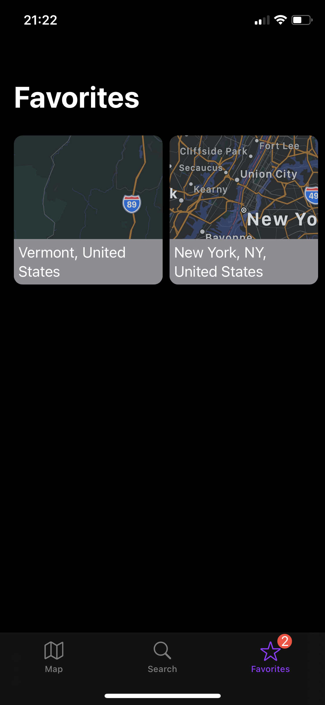

# iOS-WeatherForecast.
iOS app - WeatherForecast. Created using SwiftUI.

<table>
  <tr>
  <td></td>
  <td></td>
  <td></td>
  </tr>
 </table>

Fetching JSON data from https://openweathermap.org/ to display current weather status with weekly forecast. Location can be entered either by long pressing on map and selecting created annotation pin, or by manually inputting city name into a Search Tab. Locations can be added to the Favorites Tab, where they stay saved even after app is closed. For more pictures and GIF of navigating inside app check MDImg folder. 

NOTE:
You need to provide openweathermap API token inside WeatherFetch Class in ViewModel.swift. To obtain one, simpy register on https://openweathermap.org/
